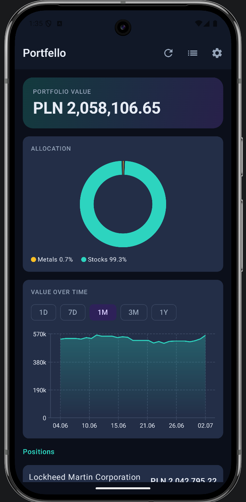
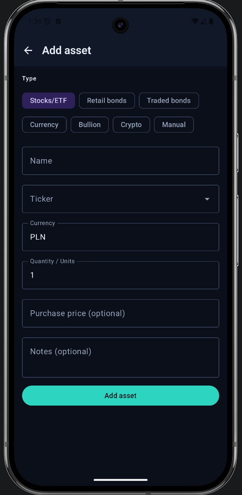

<div align="center">

# Portfello

**Private, encrypted portfolio tracker for Android**

Stocks · Crypto · Precious metals · Retail bonds · Currencies — all valued in one base currency, in real time.

[](https://kotlinlang.org)
[](https://developer.android.com/jetpack/compose)
[-3DDC84?logo=android&logoColor=white)](https://developer.android.com)
[](https://www.zetetic.net/sqlcipher/)
[](#)

<br/>

<table>
  <tr>
    <td align="center"></td>
    <td align="center"></td>
  </tr>
  <tr>
    <td align="center"><sub><b>Dashboard</b> — hero card, allocation donut, portfolio history</sub></td>
    <td align="center"><sub><b>Add asset</b> — stocks, bonds, currencies, bullion, crypto, manual</sub></td>
  </tr>
</table>

</div>

---

## Features

- **Multi-asset valuation** — stocks & ETFs (Yahoo Finance), crypto (CoinGecko), FX (NBP / Frankfurter), gold & bullion (NBP spot × weight × purity + premium), Polish retail bonds (accrued-interest formula), manual assets
- **Profit / Loss tracking** — cost basis from purchase prices, signed P/L with percentage on the dashboard, list, and detail screens
- **24h / 7d change badges** — computed from locally stored price snapshots, no extra API calls
- **Portfolio history** — timestamped snapshots power the value-over-time chart (Vico), including bullion positions
- **Encrypted at rest** — SQLCipher AES-256 database; key derived from your PIN via Argon2id (64 MB memory cost, 3 iterations); only a SHA-256 verification hash ever touches disk
- **Biometric unlock** — the database key is wrapped by an Android Keystore AES-GCM key gated by BIOMETRIC_STRONG
- **Background sync** — WorkManager refreshes prices on a configurable schedule; skips silently while the app is locked
- **Dark, modern UI** — custom navy/teal/violet palette, gradient hero card, donut allocation chart
- **Polski / English** — switchable in Settings via Android per-app locales
- **Encrypted backups** — export/import protected by a separate password; optional wipe-after-N-failed-PINs

## Architecture

```
UI (Compose screens + ViewModels)
        ↓ StateFlow
Domain (ValuationEngine, BondRetailCalculator, BullionValuator, CurrencyConverter)
        ↓
Repository (AssetRepository, PriceRepository)
        ↓                        ↓
Room + SQLCipher          Network clients (CoinGecko, Yahoo, NBP, Frankfurter)
```

`ValuationEngine` dispatches per asset type, converts every result to the user's base currency, and falls back to the last cached price snapshot on network failure.

| Layer | Technology |
|---|---|
| UI | Jetpack Compose · Material 3 · Navigation Compose · Vico 2 charts |
| Architecture | MVVM · Repository · Domain layer |
| DI | Hilt (KSP code generation) |
| Persistence | Room 2.7 · SQLCipher 4.6 |
| Security | Argon2id (argon2kt) · Android Keystore · BiometricPrompt |
| Network | OkHttp 4 · Moshi |
| Async | Kotlin Coroutines · Flow |
| Background | WorkManager · HiltWorker |
| Tests | JUnit 4 · MockK · kotlinx-coroutines-test |
| Build | Gradle 9 · AGP 9 · Kotlin 2.2 · KSP2 · R8 |

## Price sources

| Asset type | Source |
|---|---|
| Stocks & ETFs | Yahoo Finance |
| Crypto | CoinGecko (optional API key in Settings) |
| FX (PLN cross-rates) | NBP Table A |
| FX (other pairs) | Frankfurter (ECB) |
| Gold | NBP daily PLN/gram fixings (1Y of history) |
| Silver / Platinum / Palladium | Yahoo Finance futures, troy-oz → gram |

All sources are public — **no API keys required**.

## Security model

1. On first launch you set a PIN; Argon2id derives a 32-byte key from it.
2. That key **is** the SQLCipher database key — it is never written to disk. Only `SHA-256(key)` is stored for PIN verification.
3. With biometrics enabled, the key is additionally wrapped by a per-use Android Keystore AES-GCM key requiring BIOMETRIC_STRONG authentication.
4. On lock, the key is zeroed in memory; the screen is protected with `FLAG_SECURE` (no screenshots, hidden in recents).
5. Optional: wipe the database (including WAL/SHM) after N failed PIN attempts.

## Building

```bash
./gradlew assembleDebug        # debug APK
./gradlew testDebugUnitTest    # unit tests, no emulator needed
```

Requires JDK 21 and the Android SDK (min API 26, target API 36).
